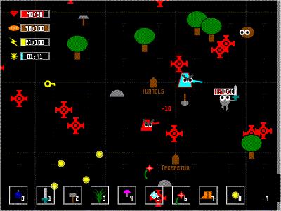

Game Framework
==============

The TypeScript code in this repository implements a video game framework and demonstrates its features with a simple video game.

</img>

Running
-------

To run, open the file GameFramework.html in a web browser that runs JavaScript.  Because the latest compiled .js files are included as part of the repository, it should not be necessary to build the game first before it can be run.

If running the .html from the filesystem using the "file://" scheme rather than through a web server, it may be necessary to disable some security features of the browser in order to allow content files to be loaded.  For example, the Google Chrome or Chromium browsers can be run with the --allow-file-access-from-files command-line switch.

Building
--------

* Install Node.js.
* Install the Typescript compiler TSC with the command "npm install tsc".
* Run the command "tsc" within the "Source" directory.

Features
--------

* Display - System-level graphics concepts are abstracted behind interfaces.
* Controls - Buttons, lists, text boxes, scrollbars, tabs, and so on.
* Storage - Player profiles and saving and loading games to and from browser local storage or files.
* Media - Loading and presenting images, sounds, music, videos, fonts, text, and data files.
* Physics - Position, orientation, movement, and collision detection and response.
* Model - Common game concepts like inventory, equipment, crafting, conversations, skills, containers, and trade.

Screenshots
-----------

Documentation
-------------

A high-level overview of the architecture of the framework is available at <a href="Documentation/Architecture.md">Documentation/Architecture.md</a>.

A quick-start guide for creating a new game from the supplied stub game is available at <a href="Documentation/Creating_a_New_Game_from_Stubs.md">Documentation/Creating_a_New_Game_from_Stubs.md</a>.

A partial Development Guide illustrating the creation of a new game from the supplied stub game is available at <a href="Documentation/Development_Guide/Development_Guide.md">Documentation/Development_Guide/Development_Guide.md</a>.

Testing
-------

An automated testing framework is provided in the Tests directory, along with a test suite that uses it.  As of this writing, the test suite incorporates only a few test fixtures.  To run the tests, open Tests/Tests.html in a web browser that runs JavaScript.  To add a new fixture to the test suite, implement a new subclass of the TestFixture class in the Tests/Test directory, then modify the script at the bottom of Tests.html to include the new fixture.  To recompile the tests after changes, run the command "tsc" from within the Tests directory.
