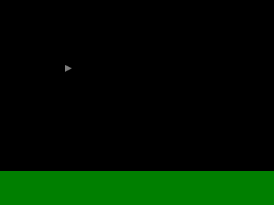
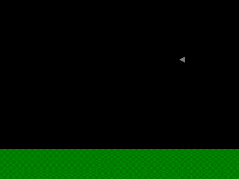
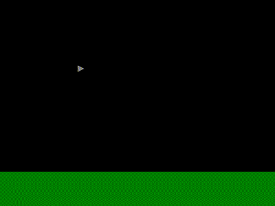
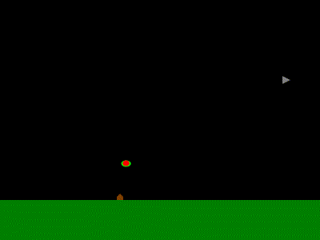

This Could Be Better Game Framework Development Guide
=====================================================

This guide illustrates the creation of a new game from scratch using the This Could Be Better Game Framework.

1. Setting Up a New Game from Stubs
-----------------------------------

1.1. First, we need to create a new game based on the stub game.  Download a copy of the GameFrameworkTS repository by running this command:

	git clone https://github.com/thiscouldbebetter/GameFrameworkTS

1.2. Then, within the repository, locate the "Source/Stub" directory.

1.3. Copy the Stub directory to any convenient locatation outside of the original GameFrameworkTS repository.

1.4. Now we need to decide what to call our new game.  Let's make a clone of the classic arcade game Defender, in which the player controls a spaceship tasked with protecting the population of a planet from alien abduction.  Rename the Stub directory to "DefenderClone".

1.5. From within the newly renamed DefenderClone directory, run the following command to run a script that converts the directory into Git repository and add the framework as a submodule (or, if running on a Windows machine, run the .bat equivalent):

	./Setup-Git-Init\_Repo\_and\_Add\_Framework\_Submodule.sh

1.6. Delete the file "./Setup-Git-Init\_Repo\_and\_Add\_Framework\_Submodule.sh" and its .bat equivalent, as they will no longer be needed.  

1.7. In the DefenderClone directory, open the Source directory.

1.8. Delete the files "GameStub-RunsInPlace.html" and "./Setup-Git-Init_Repo_and_Add_Framework_Submodule.sh", as they will no longer be needed.  Also, delete all the existing ".js" files in the directory, since we'll be renaming one of the corresponding ".ts" files and if we don't delete it, the .js file with the old name will just hang around forever.

1.9. In the Source directory, rename the file "GameStub.html" to "DefenderClone.html".  

1.10. Still in the Source directory, open the file "Game.ts" in a text editor, locate the call to Universe.create(), change the first argument from "GameStub" to "DefenderClone", and save.  This string will be used to name any saved game files.

1.11. Most of the gameplay in classic arcade games take place on "levels", so let's rename the PlaceStub class accordingly.  Still in the Source directory, rename the file "PlaceStub.ts" to "PlaceLevel.ts".

1.12. Open the newly renamed file PlaceLevel.ts in a text editor, replace all instances of the text "Stub" with "Level" (there are four of them), and save.  When you're done, it should look like this:

	class PlaceLevel extends Place
	{
		constructor()
		{
			super
			(
				PlaceLevel.name,
				PlaceLevel.defnBuild().name,
				Coords.fromXY(400, 300), // size
				 // entities
				[
					new UserInputListener()
				]
			);
		}

		static defnBuild(): PlaceDefn
		{
			var actionDisplayRecorderStartStop = DisplayRecorder.actionStartStop();
			var actionShowMenu = Action.Instances().ShowMenuSettings;

			var actions =
			[
				actionDisplayRecorderStartStop,
				actionShowMenu
			];

			var inputNames = Input.Names();

			var actionToInputsMappings =
			[
				new ActionToInputsMapping
				(
					actionDisplayRecorderStartStop.name, [ "~" ], true // inactivate
				),

				ActionToInputsMapping.fromActionNameAndInputName
				(
					actionShowMenu.name, inputNames.Escape
				)
			];

			var entityPropertyNamesToProcess: string[] =
			[
				Actor.name,
				Collidable.name,
				Constrainable.name,
				Locatable.name
			];

			return PlaceDefn.from4
			(
				PlaceLevel.name,
				actions,
				actionToInputsMappings,
				entityPropertyNamesToProcess
			);
		}
	}

1.13. Still in the Source directory, open the file "WorldGame.ts" in a text editor.  Locate the constructor, and change the first argument to the super() constructor from "GameStub" to "DefenderClone".  Replace both instances of the text "PlaceStub" with "PlaceLevel".  Save the file.  When you're done, it should look like the following:

	class WorldGame extends World
	{
		constructor()
		{
			super
			(
				"DefenderClone",
				DateTime.now(),
				WorldGame.defnBuild(),
				[ new PlaceLevel() ]
			);
		}

		static defnBuild(): WorldDefn
		{
			return new WorldDefn
			([
				[
					ActivityDefn.Instances().HandleUserInput
				],
				[
					PlaceLevel.defnBuild()
				]
			]);
		}

		toControl(): ControlBase
		{
			return new ControlNone();
		}
	}

1.14. From the Source directory, run the command "tsc" to compile the program.  Wait for the command to complete, and verify that no errors are displayed and that a .js file is generated for each of the .ts files in the Source directory.

1.15. Open the file "DefenderClone.html" in a text editor.  This is the file that hosts your program, and it contains references to every class file you use in your program.  Change the reference to "PlaceStub.js" to instead reference "PlaceLevel.js".  You'll need to add a corresponding entry to this file every time you start using a new class.  The edited line for the reference to PlaceLevel will look like this.

	

1.15. Open the file DefenderClone.html in a web browser that runs JavaScript.  Click the "Start" buttons on the opening, producer, and title screens to dismiss 
 them, then click the "Skip" button to skip creation of a player profile.  A black screen will displayed.  If you'd like, you can press the Escape key to see some game and settings menus.
 

2. Creating the Ground
----------------------

2.1. That blank void is pretty boring.  Let's lay the foundation of our game, literally, by adding some ground.

2.2. First, we'll add a class to represent it.  But before that, we'll need somewhere to put that class file.  Within the Source directory, create a new directory named "Model".

2.3. Within the newly created Model directory, create a new file named "Planet.ts", containing the text below:

	class Planet extends Entity
	{
		constructor(name: string, size: Coords, horizonHeight: number)
		{
			super
			(
				name,
				[
					Drawable.fromVisual
					(
						VisualRectangle.fromSizeAndColorFill
						(
							Coords.fromXY(size.x, horizonHeight),
							Color.Instances().GreenDark
						)
					),

					Locatable.fromPos
					(
						Coords.fromXY(size.x / 2, size.y - horizonHeight / 2)
					),
				]
			);
		}
	}

2.4. The new Planet class is a subclass of Entity, and it has two properties, namely, Drawable and Locatable.  An instance of Drawable represents something that can be drawn to the screen, while an instance of Locatable represents something that has a specific position and orientation (and, incidentally, velocity and acceleration, among other things, as will be discussed later).

2.5. Note the occurrence of the "VisualRectangle" class in the constructor of the newly declared Planet class.  The VisualRectangle class is already defined as part of the framework.

2.6. Because we just added a reference to a class from the framework, we need to update Imports.ts accordingly.  This file "imports" classes from the framework so that you don't have to put "ThisCouldBeBetter.GameFramework." in front of every single class name every time you use it, which would get tedious pretty quickly.

2.7. Back in the Source directory, open Imports.ts in a text editor and locate the existing line:

	import VisualNone = gf.VisualNone;

2.8. Then add the following line right below it, and save:

	import VisualRectangle = gf.VisualRectangle;

2.9. Remember that you'll need to add entries to Imports.ts almost every time you create a new class, or when you use a new class from the framework.  I say "almost every time" rather than just "every time" because some classes, like Entity, Drawable, Locatable, and VisualGroup, are already referenced as part of the stub game.

2.10. We'll also need to add a reference to the newly created and added classes to DefenderClone.html.  But be careful:  If you add references in the wrong place, it might break your game.

2.11. Let's start by adding a reference to the VisualRectangle class file.  Open DefenderClone.html and locate this existing line within it:

	

2.12. Add this line beneath it:

	

2.13. Next, locate the existing reference to "WorldGame.js", add this line just below it, and save:

	

2.14. Now that we've declared the Planet class and added references to it and to the VisualRectangle class that we need to draw it, we'll add an instance of Planet to PlaceLevel.

2.15. Back in the Source directory, open the file PlaceLevel.ts in a text editor.  Locate the constructor, and within it, the array being passed as the "entities" argument of the super() constructor.  Within that array, locate the existing "new UserInputListener()" element, add a comma after it, add the following text on the line below, then save the file.

	new Planet("Planet0", Coords.fromXY(400, 300), 50)

2.16. From the Source directory, run the command "tsc" to compile the program again.  Wait for the command to complete, and verify that no errors are displayed.

2.17. In the web browser, refresh DefenderClone.html and advance through the startup screens to start the game again.  Verify that a green field, representing the ground, appears at the bottom of the screen.

3. Adding a Ship for the Player
-------------------------------

3.1. Now there's some ground, but ground by itself is almost as boring as a void.  Let's add a spaceship.  For that, we'll need another class file.

3.2. Back in the Model directory, create a new file name "Ship.ts", containing the text below:

	class Ship extends Entity
	{
		constructor(name: string, pos: Coords)
		{
			super
			(
				name,
				[
					Drawable.fromVisual
					(
						VisualPolygon.fromVerticesAndColorFill
						(
							[
								Coords.fromXY(-5, -5),
								Coords.fromXY(5, 0),
								Coords.fromXY(-5, 5),
							],
							Color.Instances().Gray
						)
					),

					Locatable.fromPos(pos)
				]
			);
		}
	}

3.3. Like the Planet class, the new Ship class is a subclass of Entity, and it has its own instances of the same two property types, namely, Drawable and Locatable.

3.4. Since we've added a new class, we'll need to add a reference to it in DefenderClone.html.  Add the following line right below the one recently added for Planet.js, and save:

	

3.5. The Ship class also uses a new class from the framework, namely "VisualPolygon".  And the VisualPolygon class itself uses yet another class from the framework, namely "Path" (pretty sneaky!).  So we'll need to add references to both those classes in Imports.ts.  Add the following lines right below the one recently added for VisualRectangle and save:

	import VisualPolygon = gf.VisualPolygon;
	import Path = gf.Path;

3.6. And in DefenderClone.html, again right below the line for VisualRectangle, add these line and save:

	
	

3.7. (For extra credit, you could move those references to the Path class somewhere else in the Import.ts and DefenderClone.html files, like maybe where all the other things in the "Geometry/Shapes" directory are referenced.  And for extra extra credit, maybe put it in alphabetical order in there!  But putting it next to VisualPolygon is good enough for now.)

3.8. Now that the Ship class is defined and referenced, let's create an instance of it and add it to the entity collection of our PlaceLevel instance.  Back in the Source directory, open the file PlaceLevel.ts in a text editor again.  Within the array being passed as the "entities" argument of the super() constructor, add the following line, then make sure that there are commas between all the array elements and save the file.

	new Ship("Ship0", Coords.fromXY(100, 100))

3.9. Compile the program again by running "tsc", then refresh DefenderClone.html, start the game, and progress past the startup screens.  A gray triangle pointing right, representing a spaceship, now appears above the ground.

4. Making the Ship Move
-----------------------

4.1. Now there's a spaceship, which should be exciting.  But it doesn't move.  So it's still pretty boring for a spaceship.  More of a spaceblimp.  Except even blimps move a little bit.  Let's make it move.

4.2. To make it move, we'll assign it a velocity to go along with its position.  Open Ship.ts in a text editor, replace the line "Locatable.fromPos(pos)" with the following text, and save:

	new Locatable
	(
		Disposition.fromPosAndVel
		(
			Coords.fromXY(100, 100), // pos
			Coords.fromXY(1, 0) // vel
		)
	)

4.3. Compile the program again, then refresh DefenderClone.html and start the game.  The same gray, triangular spaceship still appears, but now it moves.  It moves all the way to the right side of the screen, then disappears, never to return.

5. Making the Ship Wrap Around
------------------------------

5.1. The spaceship is briefly somewhat more interesting than when it was stationary, but once it moves off the right side of the screen, the view is even more boring that it was before.  To fix that, that, we can make the screen "wrap", so that when the spaceship moves off the right side of the screen, it reappears on the left side.  That, in turn, can be accomplished by giving the Ship entity the Constrainable property and putting a Constraint on it.

5.2. Open Ship.ts and, in the list of properties being passed to the super() constructor, add the following text, making sure to add commas between elements as appropriate:

	Constrainable.fromConstraint
	(
		new Constraint_WrapToPlaceSizeXTrimY()
	)

5.3. Since Constraint_WrapToPlaceSizeXTrimY is a previously unused class from the framework, we'll need to add references to it in DefenderClone.html and Imports.ts.  The line to be added to Imports.ts looks like this, and it can be added just after the recently added reference to the Path class (or someplace better if desired):

	import Constraint_WrapToPlaceSizeXTrimY = gf.Constraint_WrapToPlaceSizeXTrimY;

5.4. The line to be added to DefenderClone.html looks like this, and likewise can be added just after the recently added reference to the Path class.

	

5.5. Recompile the game by running "tsc", refresh the web browser, and advance past the starting screens.  When the ship leaves the right side of the screen, it reappears on the left, in a repeating cycle.

6. Making the Ship Accelerate Back and Forth
--------------------------------------------

6.1. Now the ship wraps to stay in view continuously, so the view stays interesting.  It would be more interesting still if the ship changed speed and direction.  To make that work, we need to give it the Actor property. 

6.2. To define the ActivityDefn for the ship's behavior, open Ship.ts and add the following method after the constructor:

	static activityDefnDoSpaceshipStuffBuild(): ActivityDefn
	{
		var activityDefnDoSpaceshipStuff = new ActivityDefn
		(
			"DoSpaceshipStuff",
			// perform
			(uwpe: UniverseWorldPlaceEntities) =>
			{
				var place = uwpe.place;
				var entity = uwpe.entity;

				var placeWidthHalf = place.size.x / 2;

				var ship = entity as Ship;
				var shipLoc = ship.locatable().loc;
				var shipPos = shipLoc.pos;
				var shipOrientation = shipLoc.orientation;
				var shipForward = shipOrientation.forward;
				var shipAccel = shipLoc.accel;
				if (shipPos.x > placeWidthHalf)
				{
					shipForward.x = -1;
				}
				else
				{
					shipForward.x = 1;
				}
				shipOrientation.forwardSet(shipForward);

				var accelerationPerTick = 0.1;
				shipAccel.x = shipForward.x * accelerationPerTick;
			}
		);

		return activityDefnDoSpaceshipStuff;
	}

6.3. Now that the ActivityDefn for the Ship is defined, we want to make sure that the WorldDefn knows about it, so that it's there when the Ship entity's Actor property tries to look it up.  Open WorldGame.ts and replace the existing .defnBuild() method with the following text:

	static defnBuild(): WorldDefn
	{
		return new WorldDefn
		([
			[
				UserInputListener.activityDefnHandleUserInputBuild(),
				Ship.activityDefnDoSpaceshipStuffBuild()
			],
			[
				PlaceLevel.defnBuild()
			]
		]);
	}

6.4. Finally, give the Actor property to the Ship.  In Ship.ts, add a new entry to the array of entity properties, right below the Locatable instance, again making sure to include a comma between each element in the array:

	Actor.fromActivityDefnName("DoSpaceshipStuff")

6.5. Compile the program again, then refresh DefenderClone.html and start the game.  The spaceship now accelerates toward the right side of the screen if it's on the left half of the screen, and accelerates toward the left side of the screen if it's on the right side of the screen.

6.6. Furthermore, our spaceship faces to the right when it's accelerating right, and to the left when it's accelerating left.  Ordinarily, we'd need to modify the Visual for the Ship for this to work, but since we're using a VisualPolygon, by default it automatically transforms the visual based on the Ship's orientation.  And we already added the code to set the Ship's orientation, in the same place where we're setting the acceleration, that is, in Ship.activityDefnDoSpaceshipStuffBuild().  Nice!

7. Letting the User Control the Ship
---------------------------------

7.1. It'd be even nicer if we could steer the ship.  Going where the driver wants to go is a major component of consumer satisfication with any vehicle.

7.2. To do that, we need to add some Actions that the ship can perform in order to accelerate up, down, left, or right, and then we need to associate, or "map", those Actions to keyboard inputs using some ActionToInputsMapping instances.

7.3. The Actions we need happen to already be defined as part of the Movable class, so they and their corresponding mappings just need to be registered in the PlaceLevel class.  Open PlaceLevel.ts, replace the existing declarations of the actions and actionToInputMappings arrays with the text below, and save.

	var actions =
	[
		actionDisplayRecorderStartStop,
		actionShowMenu,

		Movable.actionAccelerateDown(),
		Movable.actionAccelerateLeft(),
		Movable.actionAccelerateRight(),
		Movable.actionAccelerateUp()
	];

	var inputNames = Input.Names();

	var actionToInputsMappings =
	[
		new ActionToInputsMapping
		(
			actionDisplayRecorderStartStop.name, [ "~" ], true // inactivate
		),

		ActionToInputsMapping.fromActionNameAndInputName
		(
			actionShowMenu.name, inputNames.Escape
		),

		ActionToInputsMapping.fromActionNameAndInputName
		(
			Movable.actionAccelerateDown().name, inputNames.ArrowDown
		),
		ActionToInputsMapping.fromActionNameAndInputName
		(
			Movable.actionAccelerateLeft().name, inputNames.ArrowLeft
		),
		ActionToInputsMapping.fromActionNameAndInputName
		(
			Movable.actionAccelerateRight().name, inputNames.ArrowRight
		),
		ActionToInputsMapping.fromActionNameAndInputName
		(
			Movable.actionAccelerateUp().name, inputNames.ArrowUp
		)
	];

7.4. This code defines the Actions and the input mappings for them, but in order to actually use them, we'll need to give the Ship entity the Movable property.  We also need to change its Actor property's activity so that it listens to the user's input rather than mindlessly shuttling back and forth forever.

7.5. Open Ship.ts and replace the existing declaration of the Actor property with the following text:

	Actor.fromActivityDefnName
	(
		UserInputListener.activityDefnHandleUserInputBuild().name
	),

	Movable.fromAccelerationAndSpeedMax(0.2, 2)

7.6. Also, now that we're not using the "DoSpaceshipStuff" ActivityDefn, we can remove the declaration of the static Ship.activityDefnDoSpaceshipStuffBuild() method entirely.  (I know we just added it, but less code is always better!  Technically, for quality's sake we should've quit before we started.)

7.7. Because we removed the declaration of the "DoSpaceshipStuff" ActivityDefn, we'll also need to remove the reference to it.  Open WorldGame.ts and, in the static .defnBuild() method, remove the line "Ship.activityDefnDoSpaceshipStuffBuild()" from the ActivityDefns being passed to the WorldDefn constructor call.

7.8. Now that the Ship entity is listening for user input, we no longer need that instance of UserInputListener() that came built-in to the stub code.  Two entities listening and reacting to the same input might get weird.  Open PlaceLevel.ts again and, in the constructor, remove the line "new UserInputListener()" from the list of entities being passed to the super() call.

7.9. After compiling the program, refreshing the web browser, and starting the game, use the arrow keys to cause the spaceship to acelerate up, down, left, and right.  You're a driver, you're a winner.

8. Adding an Ally and an Enemy
------------------------------

8.1. Driving around aimlessly is fun for a while, but conflict is the essence of drama.  It's time to add a villain and a victim, so that you can be the rescuer.

8.2. First, we'll create the victim, which we'll call a Habitat.  In the Model directory, add a new file named "Habitat.ts", containing the following text:

	class Habitat extends Entity
	{
		constructor(pos: Coords)
		{
			super
			(
				Habitat.name,
				[
					Constrainable.create(),

					Drawable.fromVisual
					(
						VisualPolygon.fromVerticesAndColorFill
						(
							[
								Coords.fromXY(4, 0),
								Coords.fromXY(-4, 0),
								Coords.fromXY(-4, -4),
								Coords.fromXY(0, -8),
								Coords.fromXY(4, -4),
							],
							Color.byName("Brown")
						)
					),

					Locatable.fromPos(pos)
				]
			);
		}
	}

8.3. Next, we'll create the villain, which we'll call a "Raider".  Still in the Model directory, create a new file named Raider.ts, containing the following text.  This class is quite a bit more complex than the previous one, since the Raider has to actually move around and kidnap people and stuff, while all the Habitat has to do is sit there looking vulnerable.

	class Raider extends Entity
	{
		habitatCaptured: Habitat;

		_displacement: Coords;

		constructor(pos: Coords)
		{
			super
			(
				Raider.name,
				[
					Actor.fromActivityDefnName
					(
						Raider.activityDefnBuild().name
					),

					Constrainable.fromConstraint
					(
						new Constraint_WrapToPlaceSizeX()
					),

					Drawable.fromVisual
					(
						new VisualGroup
						([
							VisualEllipse.fromSemiaxesAndColorFill
							(
								6, 4, Color.byName("Green")
							),
							VisualEllipse.fromSemiaxesAndColorFill
							(
								4, 3, Color.byName("Red")
							),
							new VisualFan
							(
								4, // radius
								.5, .5, // angleStart-, angleSpannedInTurns
								Color.byName("Red"), null // colorFill, colorBorder
							)
						])
					),

					Locatable.fromPos(pos),

					Movable.fromAccelerationAndSpeedMax(2, 1)
				]
			);

			this._displacement = Coords.create();
		}

		static activityDefnBuild(): ActivityDefn
		{
			return new ActivityDefn
			(
				Raider.name, Raider.activityDefnPerform
			);
		}

		static activityDefnPerform(uwpe: UniverseWorldPlaceEntities): void
		{
			var universe = uwpe.universe;
			var place = uwpe.place;
			var entity = uwpe.entity;

			var raider = entity as Raider;

			var raiderPos = raider.locatable().loc.pos;

			var raiderActor = raider.actor();
			var raiderActivity = raiderActor.activity;
			var targetEntity = raiderActivity.targetEntity();

			if (targetEntity == null)
			{
				var placeLevel = place as PlaceLevel;
				var habitats = placeLevel.habitats();
				if (habitats.length == 0)
				{
					return; // todo
				}
				else
				{
					targetEntity = ArrayHelper.random
					(
						habitats, universe.randomizer
					);
					raiderActivity.targetEntitySet(targetEntity);
				}
			}

			var targetPos = targetEntity.locatable().loc.pos;
			var displacementToTarget = raider._displacement.overwriteWith
			(
				targetPos
			).subtract
			(
				raiderPos
			);
			var distanceToTarget = displacementToTarget.magnitude();
			var raiderMovable = raider.movable();
			if (distanceToTarget >= raiderMovable.accelerationPerTick)
			{
				var displacementToMove = displacementToTarget.divideScalar
				(
					distanceToTarget
				).multiplyScalar
				(
					raiderMovable.speedMax
				);
				raiderPos.add(displacementToMove);
			}
			else
			{
				raiderPos.overwriteWith(targetPos);
				if (raider.habitatCaptured == null)
				{
					raider.habitatCaptured = targetEntity;

					var targetConstrainable = targetEntity.constrainable();

					var constraintAttach =
						new Constraint_AttachToEntityWithId(raider.id);
					targetConstrainable.constraintAdd(constraintAttach);

					var constraintOffset =
						new Constraint_Offset(Coords.fromXY(0, 10));
					targetConstrainable.constraintAdd(constraintOffset);

					targetEntity = new Entity
					(
						"EscapePoint",
						[
							Locatable.fromPos
							(
								raiderPos.clone().addXY
								(
									0, 0 - place.size.y
								)
							)
						]
					);
					raiderActivity.targetEntitySet(targetEntity);
				}
				else
				{
					place.entityToRemoveAdd(raider.habitatCaptured);
					place.entityToRemoveAdd(raider);
				}
			}
		}
	}

8.4. The Raider class uses the previously unreferenced framework classes Constraint_AttachToEntityWithId, Constraint_Offset, Constraint_WrapToPlaceSizeX, VisualEllipse, and VisualFan, which are new to our program and so will need to be referenced in Imports.ts, like this:

	import Constraint_AttachToEntityWithId = gf.Constraint_AttachToEntityWithId;
	import Constraint_Offset = gf.Constraint_Offset;
	import Constraint_WrapToPlaceSizeX = gf.Constraint_WrapToPlaceSizeX;
	import VisualEllipse = gf.VisualEllipse;
	import VisualFan = gf.VisualFan;

8.5. And of course in DefenderClone.html, like this:

	
	
	

	
	

8.6. The Raider class also makes use of the method PlaceLevel.habitats() to get a convenient array of all the Habitats on the level.  However, the sharp-eyed observer will note that that method doesn't exist yet.  So open PlaceLevel.ts and add the following lines just before the final close brace of the class:

	habitats(): Habitat[]
	{
		return this.entities.filter(x => x.constructor.name == Habitat.name) as Habitat[];
	}

8.7. Also, the Raider class uses the Actor property, and defines its very own ActivityDefn to use with it, so we need to register that ActivityDefn with the WorldDefn.  Open WorldGame.ts and replace the existing .defnBuild() method with the following:

	static defnBuild(): WorldDefn
	{
		return new WorldDefn
		([
			[
				UserInputListener.activityDefnHandleUserInputBuild(),
				Raider.activityDefnBuild()
			],
			[
				PlaceLevel.defnBuild()
			]
		]);
	}

8.8. Finally, we need to the reference the newly declared Habitat and Raider classes, but since they're not from the framework, and thus are not part of any namespace, and thus don't need to be imported, we can leave Imports.ts alone.  We only have to add references to them in DefenderClone.html.  Probably these should go right after the recently added ones for Planet and Ship:

	
	

8.9. Now we'll add one Habitat and one Raider to the level.  Open PlaceLevel.ts, and, in the constructor, add these two lines to bottom of the array of Entities being passed to the super() call.  Make sure to separate all the array elements with commas as appropriate:

	new Habitat(Coords.fromXY(150, 250) ),
	new Raider(Coords.fromXY(200, -50) )

8.10. Finally, re-compile the game, refresh the web browser, and start the game.  Now a civilian Habitat appears on the ground.  An alien Raider will descend from the top of the screen, pick up the Habitat, carry it back up to the top of the screen, and disappear forever.  Tragic!

9. Adding Weapons
-----------------

9.1. Right now, there's nothing you can do about aliens kidnapping your people, because your ship has no weapons.  You just have to sit and watch as the people you swore to protect are abducted by aliens with clearly nefarious intent.  How does it feel?  Feels bad, right?  

So let's give this kitten some claws.  (The kitten is your spaceship.  The claws are, like, plasma blasters.)

9.2. To give your spaceship the ability to fire bullets, open Ship.ts and add these lines to the list of entity properties in the constructor, remembering to add a comma to separate array elements:

	new ProjectileGenerator
	(
		"Bullet",
		[
			ProjectileGeneration.fromVisual
			(
				VisualSound.default()
			),

			new ProjectileGeneration
			(
				2, // radius
				5, // distanceInitial
				4, // speed
				128, // ticksToLive
				Damage.fromAmount(1),
				VisualCircle.fromRadiusAndColorFill
				(
					2, Color.byName("Yellow")
				)
			)
		]
	)

9.3. Now your ship has a gun, but no trigger.  That is to say, it could technically generate bullets, only there's no ActionToInputsMapping to detect when you want to fire them, and even if there were, there's no Action to map that mapping to.  To add the Action and its mapping, open PlaceLevel.ts and, in the .defnBuild() method, add this line to the end of the "actions" array:

	ProjectileGenerator.actionFire()

9.4. And these lines to the end of "actionsToInputMappings" array:

	new ActionToInputsMapping
	(
		ProjectileGenerator.actionFire().name,
		[ inputNames.Space ],
		true // inactivateInputWhenActionPerformed
	)

(As always, remember to delimit these new array elements from the existing ones with commas.)

9.5. You'll also need to add the ProjectileGenerator class and some supporting classes to Imports.ts, like this:

	import ProjectileGenerator = gf.ProjectileGenerator;
	import ProjectileGeneration = gf.ProjectileGeneration;
	import VisualCircle = gf.VisualCircle;
	import Ephemeral = gf.Ephemeral;
	import DiceRoll = gf.DiceRoll;

9.6. And also add it to DefenderClone.html, as shown below.  Actually, you may want to add references to several related classes while you're at it:

	
	
	
	

	

	

9.7. Re-compile the game and refresh the web browser.  The good news is, your spaceship will now shoot bullets when you press the spacebar!

10. Making Weapons Work
-----------------------

10.1. The bad news is, those bullets don't do anything yet.  Even if you manage to hit the Raider with them, they'll just pass harmlessly through it, because right now it's pretty much immortal.  It's too dumb to die!

10.2. So let's make it mortal.  Open Raider.ts and add the following lines to the array of entity properties being declared in the constructor.  You could add them at the end of the array, or make things a bit neater and add them in alphabetical order.  Whichever you choose, be sure to add commas in the proper places.

	Collidable.fromCollider(Sphere.fromRadius(4) ),

	Killable.fromIntegrityMax(1),

These lines make the Raider collidable, which means that your bullets can hit it, and killable, which means that when you bullets hit it they can hurt it.

10.3. However, in order for Collidables and Killables to be processed correctly, they'll need to be added to the list of property types that PlaceLevel understands.  Open PlaceLevel.ts and replace the existing declaration of the entityPropertyNamesToProcess array with the following:

	var entityPropertyNamesToProcess =
	[
		Locatable.name,
		Constrainable.name,
		Collidable.name,
		Actor.name,
		Ephemeral.name,
		Killable.name
	];

10.4 Re-compile the game and refresh the web browser.  Now your bullets can destroy the Raider, which is good, because otherwise what's the point of bullets, man? [TODO - The raider doesn't die.]

11. Giving the Ground Some Weight
---------------------------------

11.1. You can now save the habitat, and, by extension, the day.  However, there's still a few problems to fix.

First of all, when your ship flies into the ground, nothing happens.  When you fly real spaceships into the ground, they explode.  Just ask NASA.  Actually, you could probably ask anyone.

Second, when you destroy the Raider after it picks up the Habitat and lifts it into the air, the Habitat should fall back to the ground.  As it stands, it sort of falls already, for some strange reason, but then it just passes through the ground and disappears.  It should probably go splat too, at least if it's dropped from high enough.  But even if we don't want it to splat just yet, it should at least stop when it hits the ground.

[To be continued.]
