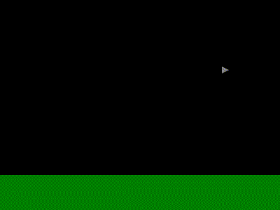

This Could Be Better Game Framework Development Guide
=====================================================

This guide illustrates the creation of a new game from scratch using the This Could Be Better Game Framework.

1. Setting Up a New Game from Stubs
-----------------------------------

1.1. Make sure that TypeScript and the Google Chrome or Chromum browser are installed on the computer.  Opening a command prompt and run the commands "tsc" and "chrome" from within it, verifying that the commands are recognized.

1.2. In any convenient location, download a copy of the GameFrameworkTS repository by opening a command prompt and running this command:

	git clone https://github.com/thiscouldbebetter/GameFrameworkTS

1.3. Then, within the directory for the newly downloaded repository, locate the "Stub" directory.

1.4. Copy the Stub directory to any convenient location outside of the original GameFrameworkTS repository's directory.

1.5. From within the newly copied Stub directory, run the following command to run a script that converts the directory into Git repository and add the framework as a submodule (if running on a Windows machine, run the ".bat" script instead):

	./Setup-Git-Init\_Repo\_and\_Add\_Framework\_Submodule.sh

1.6. Delete the file "./Setup-Git-Init_Repo_and_Add_Framework_Submodule.sh" and its .bat equivalent, as they will no longer be needed.

1.7. In the Stub directory, open the Source directory.

1.8. From the Source directory, open a command prompt, then run the command "_Build.sh" (or "_Build.bat" for Windows) to compile the program.  Wait for the command to complete, then verify that no errors are displayed and that a .js file is generated for each of the .ts files in the Source directory.  If there are errors, make sure that TypeScript is installed, and that the output of the "date" command has the format expected by the script.

1.9. Close any open instances of the Chrome or Chromium browser.

1.10. In the Source directory, locate the script named "RunChromeWithFileAccess.sh" (or the .bat equivalent if running Windows) and run it.  This will start the web browser with the necessary permissions for running the game locally without a dedicated web server.

1.11. Open Game.html in the web browser.  Press the Enter key a few times to progress past the default opening screens showing placeholder screens for the game's framework, producer, and title.  After that, a blank screen is displayed.  You can press Escape to see the menu, but there's nothing more to the game yet.

2. Creating the Ground
----------------------

2.1. That blank void is pretty boring.  Let's lay the foundation of our game, literally, by adding some ground.

2.2. First, we'll add a class to represent it.  But before that, we'll need somewhere to put that class file.  Within the Source directory, create a new directory named "Model".

2.3. Within the newly created Model directory, create a new file named "Planet.ts", containing the text below:

	class Planet extends Entity
	{
		constructor(size: Coords, horizonHeight: number)
		{
			super
			(
				Planet.name,
				[
					Drawable.fromVisual
					(
						VisualRectangle.fromSizeAndColorFill
						(
							Coords.fromXY(size.x, horizonHeight),
							Color.Instances().GreenDark
						)
					),

					Locatable.fromPos
					(
						Coords.fromXY(size.x / 2, size.y - horizonHeight / 2)
					)
				]
			);
		}

		static fromSizeAndHorizonHeight
		(
			size: Coords, horizonHeight: number
		): Planet
		{
			return new Planet(size, horizonHeight);
		}
	}

2.4. The new Planet class is a subclass of Entity, and it has two properties, namely, Drawable and Locatable.  An instance of Drawable represents something that can be drawn to the screen, while an instance of Locatable represents something that has a specific position and orientation (and, incidentally, velocity and acceleration, among other things, as will be discussed later).

2.5. We'll need to add a reference to the newly created Planet class to Game.html.  But be careful: If you add references in the wrong place, it might break your game.  Open Game.html and locate the existing reference to "_Main.js" and add this line above it, with a blank line in between:

	

2.6. Now that we've declared the Planet class and added references to it and to the VisualRectangle class that we need to draw it, we'll add an instance of Planet to PlaceDefault.

2.7. Back in the Source directory, open the file PlaceDefault.ts in a text editor.  Locate the constructor, and within it, the array being passed as the "entities" argument of the super() constructor.  Within that array, locate the existing "new UserInputListener()" element, add a comma after it, add the following text on the line below, then save the file.

	Planet.fromSizeAndHorizonHeight
	(
		Coords.fromXY(800, 300), 50
	)

2.8. From the _Scripts directory, run the command "_Build.sh" or "_Build.bat" to compile the program again.  Wait for the command to complete, and verify that no errors are displayed.

2.9. In the web browser, refresh Game.html and advance through the startup screens to start the game again.  Verify that a green field, representing the ground, appears at the bottom of the screen.

3. Adding a Ship for the Player
-------------------------------

3.1. Now there's some ground, but there's a reason the Landscape Channel went out of business.  Ground by itself is almost as boring as a void.  Let's add a spaceship for the player to fly around.  For that, we'll need another class file.

3.2. Back in the Model directory, create a new file name "Player.ts", containing the text below:

	class Player extends Entity
	{
		constructor(pos: Coords)
		{
			super
			(
				Player.name,
				[
					Drawable.fromVisual
					(
						Player.visualBuild()
					),

					Locatable.fromPos(pos),

					Playable.create()
				]
			);
		}

		static fromPos(pos: Coords): Player
		{
			return new Player(pos);
		}

		static visualBuild(): VisualBase
		{
			return VisualPolygon.fromVerticesAndColorFill
			(
				[
					Coords.fromXY(-5, -5),
					Coords.fromXY(5, 0),
					Coords.fromXY(-5, 5),
				],
				Color.Instances().Gray
			);
		}
	}

Like the Planet class, the new Player class is a subclass of Entity, and it has its own instances of the same two property types, namely, Drawable and Locatable.

3.3. Since we've added a new class, we'll need to add a reference to it in Game.html.  Add the following line right below the one recently added for Planet.js, and save:

	

3.4. Now that the Player class is defined and referenced, let's create an instance of it and add it to the entity collection of our PlaceDefault instance.  Back in the Source directory, open the file PlaceDefault.ts in a text editor again.  Within the array being passed as the "entities" argument of the super() constructor, add the following line, make sure that there are commas between all the array elements, and save the file.

	Player.fromPos(Coords.fromXY(100, 100) )

3.5. Compile the program again by running the script named "_Build", then refresh Game.html in the web browser, start the game, and progress past the startup screens as before.  A gray triangle pointing right, representing a spaceship, now appears above the ground.

	

3.6. In the browser's address bar, append the text "?debug=SkipOpening" to the end of the URL for Game.html and press the Enter key to reload.  This will skip past the opening screens to the main part of the game, saving the time and trouble needed to skip past them every time.

4. Making the Player's Ship Move
--------------------------------

4.1. Now there's a spaceship, which should be exciting.  But it doesn't move.  So it's still pretty boring for a spaceship.  More of a spaceblimp.  Except even blimps move faster than this.  So let's make it move.

4.2. To make it move, we'll assign it a velocity to go along with its position.  Open Player.ts in a text editor, replace the line "Locatable.fromPos(pos)" with the following text, and save:

	Locatable.fromDisposition
	(
		Disposition.fromPosAndVel
		(
			Coords.fromXY(100, 100), // pos
			Coords.fromXY(1, 0) // vel
		)
	)

4.3. Run the _Build script again, then refresh Game.html to see the updates.  The same gray, triangular spaceship still appears, but now it moves.  It moves all the way to the right side of the screen, then disappears, never to return.  Bye, little spaceship.  We hardly knew ye.

5. Making the Player's Ship Wrap Around
---------------------------------------

5.1. The spaceship is briefly somewhat more interesting than when it was stationary, but once it moves off the right side of the screen, the view is even more boring that it was before.  To fix that, that, we can make the screen "wrap", so that when the spaceship moves off the right side of the screen, it reappears on the left side.  That, in turn, can be accomplished by giving the Player entity the Constrainable property and putting a Constraint on it.

5.2. Open Player.ts and, somewhere in the list of properties being passed to the super() constructor, add the following text, making sure to add commas between elements as appropriate:

	Constrainable.fromConstraint
	(
		Constraint_WrapToPlaceSizeXTrimY.create()
	)

5.3. Recompile the game by running the _Build script, then refresh the web browser.  Now when the ship leaves the right side of the screen, it reappears on the left, in a repeating cycle.

6. Making the Ship Accelerate Back and Forth
--------------------------------------------

6.1. Now the ship wraps to stay in view continuously, so the view stays interesting.  It would be more interesting still if the ship changed speed and direction.  To make that work, we need to give it the Actor property. 

6.2. To define the ActivityDefn for the ship's behavior, open Player.ts and add the following method after the constructor:

	static activityDefnDoSpaceshipStuffBuild(): ActivityDefn
	{
		var activityDefnDoSpaceshipStuff = new ActivityDefn
		(
			"DoSpaceshipStuff",
			// perform
			(uwpe: UniverseWorldPlaceEntities) =>
			{
				var place = uwpe.place;
				var entity = uwpe.entity;

				var placeWidthHalf = place.size.x / 2;

				var ship = entity as Player;
				var shipLoc = ship.locatable().loc;
				var shipPos = shipLoc.pos;
				var shipOrientation = shipLoc.orientation;
				var shipForward = shipOrientation.forward;
				var shipAccel = shipLoc.accel;
				if (shipPos.x > placeWidthHalf)
				{
					shipForward.x = -1;
				}
				else
				{
					shipForward.x = 1;
				}
				shipOrientation.forwardSet(shipForward);

				var accelerationPerTick = 0.1;
				shipAccel.x = shipForward.x * accelerationPerTick;
			}
		);

		return activityDefnDoSpaceshipStuff;
	}

6.3. Now that the ActivityDefn for the Ship is defined, we want to make sure that the WorldDefn knows about it, so that it's there when the Ship entity's Actor property tries to look it up.  Open WorldGame.ts, locate the existing line that starts with "UserInputListener", and add the following line within that same array, making sure that there are commas between all the array elements:

	Player.activityDefnDoSpaceshipStuffBuild()

6.4. Finally, give the Actor property to the Player.  In Player.ts, add a new entry to the array of entity properties, right below the Locatable instance, making sure as always to include a comma between each element in the array:

	Actor.fromActivityDefnName("DoSpaceshipStuff")

6.5. Run the _Build script again, then refresh Game.html in the browser.  The spaceship now accelerates toward the right side of the screen if it's on the left half of the screen, and accelerates toward the left side of the screen if it's on the right side of the screen.

6.6. Furthermore, our spaceship faces to the right when it's accelerating right, and to the left when it's accelerating left.  Ordinarily, we'd need to modify the Visual for the Player for this to work, but since we're using a VisualPolygon, by default it automatically transforms the visual based on the Player's orientation.  And we already added the code to set the Player's orientation, in the same place where we're setting the acceleration, that is, in Player.activityDefnDoSpaceshipStuffBuild().  Nice!

7. Letting the User Control the Ship
---------------------------------

7.1. It'd be even nicer if we could steer the ship.  Going where the driver wants to go is a major component of consumer satisfication with any vehicle.

7.2. To do that, we need to add some Actions that the ship can perform in order to accelerate up, down, left, or right, and then we need to associate, or "map", those Actions to keyboard inputs using some ActionToInputsMapping instances.

7.3. The Actions we need happen to already be defined as part of the Movable class, so they and their corresponding mappings just need to be registered in the PlaceDefault class.  Open PlaceDefault.ts, locate the existing declaration of the "actions" variable, and add the following elements to the array, adding commas as necessary:

	Movable.actionAccelerateAndFaceLeft(),
	Movable.actionAccelerateAndFaceRight(),

	Movable.actionAccelerateWithoutFacingUp(),
	Movable.actionAccelerateWithoutFacingDown(),

Note that the actions selected mean that, when accelerating left and right, the player ship will turn to face the chosen direction, but it will not change direction when accelerating up and down.  This matches the behavior in the original game.

7.4. Still in PlaceDefault.ts, locate the existing declaration of the "actionToInputsMappings" array, and add these items, adjusting commas as necessary:

	ActionToInputsMapping.fromActionNameAndInputName
	(
		Movable.actionAccelerateAndFaceLeft().name,
		inputs.ArrowLeft.name
	),
	ActionToInputsMapping.fromActionNameAndInputName
	(
		Movable.actionAccelerateAndFaceRight().name,
		inputs.ArrowRight.name
	),

	ActionToInputsMapping.fromActionNameAndInputName
	(
		Movable.actionAccelerateWithoutFacingDown().name,
		inputs.ArrowDown.name
	),
	ActionToInputsMapping.fromActionNameAndInputName
	(
		Movable.actionAccelerateWithoutFacingUp().name,
		inputs.ArrowUp.name
	)

7.4. This code defines the Actions and the input mappings for them, but in order to actually use them, we'll need to give the Player entity the Movable property.  We also need to change its Actor property's activity so that it listens to the user's input rather than mindlessly shuttling back and forth forever.

7.5. Open Player.ts and replace the existing declaration of the Actor property with the following text, adjusting commas as necessary:

	Actor.fromActivityDefnName
	(
		UserInputListener.activityDefn().name
	)

7.6. Still in Player.ts, add the following to the list of properties just modified, adjusting commas as necessary:

	Movable.fromAccelerationAndSpeedMax(0.2, 2)

7.7. Also, now that we're not using the "DoSpaceshipStuff" ActivityDefn, we can remove the declaration of the static Player.activityDefnDoSpaceshipStuffBuild() method entirely.  (I know we just added it, but less code is always better!  Technically, for quality's sake we should've quit before we started.)

7.8. Because we removed the declaration of the "DoSpaceshipStuff" ActivityDefn, we'll also need to remove the reference to it.  Open WorldGame.ts and, in the static .defnBuild() method, remove the line "Player.activityDefnDoSpaceshipStuffBuild()" from the ActivityDefns being passed to the WorldDefn constructor call.

7.9. Now that the Player entity is listening for user input, we no longer need that instance of UserInputListener() that came built-in to the stub code.  Two entities listening and reacting to the same input might get weird.  Open PlaceDefault.ts again and, in the constructor, remove the line "new UserInputListener()" from the list of entities being passed to the super() call.

7.10. Run the _Build script and refresh the web browser.  Use the arrow keys to cause the spaceship to acelerate up, down, left, and right.  You're a driver, you're a winner.

8. Adding a Ally and an Enemy
-----------------------------

8.1. Driving around aimlessly is fun for a while, but conflict is the essence of drama.  It's time to add a villain and a victim, so that you can be the rescuer.

8.2. First, we'll create the victim, which we'll call a Habitat.  In the Model directory, add a new file named "Habitat.ts", containing the following text:

	class Habitat extends Entity implements EntityProperty<Habitat>
	{
		constructor(pos: Coords)
		{
			super
			(
				Habitat.name,
				[
					Constrainable.create(),

					Drawable.fromVisual
					(
						Habitat.visualBuild()
					),

					Locatable.fromPos(pos)
				]
			);

			this.propertyAdd(this);
		}

		static fromPos(pos: Coords): Habitat
		{
			return new Habitat(pos);
		}

		static visualBuild(): VisualBase
		{
			return VisualPolygon.fromVerticesAndColorFill
			(
				[
					Coords.fromXY(4, 0),
					Coords.fromXY(-4, 0),
					Coords.fromXY(-4, -4),
					Coords.fromXY(0, -8),
					Coords.fromXY(4, -4)
				],
				Color.byName("Brown")
			);
		}

		// Clonable.

		clone(): Habitat
		{
			throw new Error("Not implemented!");
		}

		overwriteWith(other: Habitat): Habitat
		{
			throw new Error("Not implemented!");
		}

		// EntityProperty

		equals(other: Habitat): boolean
		{
			return (this == other);
		}

		propertyName(): string
		{
			return Habitat.name;
		}

	}

(Observe that the Habitat class is a subclass of the Entity class, and it also implements the EntityProperty interface.  Then, in the constructor, each newly created Habitat entity adds itself as one of its properties!  This was done to save some work implementing the interface's methods, but it's perhaps a little suspect from the perspective of software architecture.  This approach will work, though, as long as the EntityProperty part doesn't have to do very much.  By contrast, the Raider class implemented in the next section will use a separate subclass of EntityProperty named RaiderProperty.)

8.3. Next, we'll create the villain, which we'll call a "Raider".  Still in the Model directory, create a new file named Raider.ts, containing the following text.  This class is quite a bit more complex than the previous one, since the raider has to actually move around and kidnap people and stuff, while all the Habitat has to do is sit there looking vulnerable.

	class Raider extends Entity
	{
		constructor(pos: Coords)
		{
			super
			(
				Raider.name,
				[
					Actor.fromActivityDefnName
					(
						Raider.activityDefnBuild().name
					),

					Collidable.fromColliderPropertyNameToCollideWithAndCollide
					(
						Sphere.fromRadius(4),
						Player.name,
						(uwpe: UniverseWorldPlaceEntities, c: Collision) =>
						{
							var entityOther = uwpe.entity2;
							if (entityOther.name == Player.name)
							{
								var playerEnitty = entityOther as Player;
								var playerKillable = Killable.of(entityPlayer);
								playerKillable.kill();
							}
						}
					),

					Constrainable.fromConstraint
					(
						Constraint_WrapToPlaceSizeX.create()
					),

					Drawable.fromVisual
					(
						Raider.visualBuild()
					),

					Locatable.fromPos(pos),

					Movable.fromAccelerationAndSpeedMax(2, 1),

					RaiderProperty.create()
				]
			);
		}

		static fromPos(pos: Coords): Raider
		{
			return new Raider(pos);
		}

		static activityDefnBuild(): ActivityDefn
		{
			return new ActivityDefn
			(
				Raider.name, Raider.activityDefnPerform
			);
		}

		static activityDefnPerform(uwpe: UniverseWorldPlaceEntities): void
		{
			var universe = uwpe.universe;
			var place = uwpe.place;
			var entity = uwpe.entity;

			var raider = entity as Raider;

			var raiderPos = Locatable.of(raider).loc.pos;

			var raiderActor = Actor.of(raider);
			var raiderActivity = raiderActor.activity;
			var targetEntity = raiderActivity.targetEntity();

			if (targetEntity == null)
			{
				var placeDefault = place as PlaceDefault;
				var habitats = placeDefault.habitats();
				if (habitats.length == 0)
				{
					return; // todo
				}
				else
				{
					targetEntity = ArrayHelper.random
					(
						habitats, universe.randomizer
					);
					raiderActivity.targetEntitySet(targetEntity);
				}
			}

			var targetPos = Locatable.of(targetEntity).loc.pos;
			var displacementToTarget =
				Raider
					.displacement()
					.overwriteWith(targetPos)
					.subtract(raiderPos);
			var distanceToTarget = displacementToTarget.magnitude();
			var raiderMovable = Movable.of(raider);
			var raiderAccelerationPerTick =
				raiderMovable.accelerationPerTick(uwpe);
			if (distanceToTarget >= raiderAccelerationPerTick)
			{
				var raiderSpeedMax =
					raiderMovable.speedMax(uwpe);
				var displacementToMove =
					displacementToTarget
						.divideScalar(distanceToTarget)
						.multiplyScalar(raiderSpeedMax);
				raiderPos.add(displacementToMove);
			}
			else
			{
				raiderPos.overwriteWith(targetPos);
				var raiderProperty = RaiderProperty.of(raider);
				if (raiderProperty.habitatCaptured == null)
				{
					raiderProperty.habitatCaptured = targetEntity as Habitat;

					var targetConstrainable =
						Constrainable.of(targetEntity);

					var constraintToAddToTarget = Constraint_Multiple.fromChildren
					([
						Constraint_AttachToEntityWithId
							.fromTargetEntityId(raider.id),
						Constraint_Transform.fromTransform
						(
							Transform_Translate.fromDisplacement
							(
								Coords.fromXY(0, 10)
							)
						)
					]);

					targetConstrainable
						.constraintAdd(constraintToAddToTarget);

					targetEntity = Entity.fromNameAndProperties
					(
						"EscapePoint",
						[
							Locatable.fromPos
							(
								raiderPos.clone().addXY
								(
									0, 0 - place.size().y
								)
							)
						]
					);
					raiderActivity.targetEntitySet(targetEntity);
				}
				else
				{
					place.entityToRemoveAdd(raiderProperty.habitatCaptured);
					place.entityToRemoveAdd(raider);
				}
			}
		}

		static _displacement: Coords;
		static displacement(): Coords
		{
			if (this._displacement == null)
			{
				this._displacement = Coords.create();
			}
			return this._displacement;
		}

		static visualBuild(): VisualBase
		{
			return VisualGroup.fromChildren
			([
				VisualEllipse.fromSemiaxesHorizontalAndVerticalAndColorFill
				(
					6, 4, Color.Instances().Green
				),
				VisualEllipse.fromSemiaxesHorizontalAndVerticalAndColorFill
				(
					4, 3, Color.Instances().Red
				),
				VisualFan.fromRadiusAnglesStartAndSpannedAndColorsFillAndBorder
				(
					4, // radius
					.5, .5, // angleStart-, angleSpannedInTurns
					Color.Instances().Red, null // colorFill, colorBorder
				)
			]);
		}
	}

	class RaiderProperty implements EntityProperty<RaiderProperty>
	{
		habitatCaptured: Habitat;

		static create()
		{
			return new RaiderProperty();
		}

		static of(entity: Entity)
		{
			return entity.propertyByName(RaiderProperty.name) as RaiderProperty;
		}

		// Clonable.

		clone(): RaiderProperty
		{
			return new RaiderProperty();
		}

		overwriteWith(other: RaiderProperty): RaiderProperty
		{
			this.habitatCaptured = other.habitatCaptured;
			return this;
		}

		// EntityProperty.

		equals(other: RaiderProperty): boolean
		{
			return (this.habitatCaptured == other.habitatCaptured);
		}

		finalize(uwpe: UniverseWorldPlaceEntities): void
		{
			// Do nothing.
		}

		initialize(uwpe: UniverseWorldPlaceEntities): void
		{
			// Do nothing.
		}

		propertyName(): string
		{
			return RaiderProperty.name;
		}

		updateForTimerTick(uwpe: UniverseWorldPlaceEntities): void
		{
			// Do nothing.
		}

	}

8.4. The Raider class uses the Actor property, and defines its very own ActivityDefn to use with it, so we need to register that ActivityDefn with the WorldDefn.  Open WorldGame.ts, locate the .defnBuild() method, and add the new activity definition in the proper place, adjusting commas as necessary:

	Raider.activityDefnBuild()

8.5. The Raider's activity makes use of the method PlaceDefault.habitats() to get a convenient array of all the Habitats on the level.  However, the sharp-eyed observer will note that that method doesn't exist yet.  So open PlaceDefault.ts and add the following lines just before the final close brace of the class:

	habitats(): Habitat[]
	{
		return this.entitiesByPropertyName(Habitat.name) as Habitat[];
	}

8.6. We also need to add references to the newly declared Habitat and Raider classes in Game.html.  These should be added near the ones previously added for Planet and Player:

	
	

8.7. Now we'll add one habitat and one raider to the level.  Open PlaceDefault.ts, and, in the constructor, add these two lines to the array of Entities being passed to the super() call.  Make sure to separate all the array elements with commas as appropriate:

	Habitat.fromPos(Coords.fromXY(150, 250) ),
	Raider.fromPos(Coords.fromXY(100, -50) )

8.8. Finally, run the build script and refresh the web browser.  Now a civilian habitat appears on the ground.  An alien raider will descend from the top of the screen, pick up the habitat, carry it back up to the top of the screen, and disappear forever.  Tragic!

9. Adding Weapons
-----------------

9.1. Right now, there's nothing you can do about aliens kidnapping your people, because your ship has no weapons.  You just have to sit and watch as the people you swore to protect are abducted by aliens with clearly nefarious intent.  How does it feel?  Feels bad, right?  

So let's give this kitten some claws.  (The kitten is your spaceship.  The claws are, like, plasma blasters.)

9.2. To give your spaceship the ability to fire bullets, open Player.ts and add these lines to the list of entity properties in the constructor, remembering to adjust commas to separate array elements:

	ProjectileGenerator.fromNameAndGenerations
	(
		"Bullet",
		[
			ProjectileGeneration.fromRadiusDistanceSpeedTicksDamageAndVisual
			(
				2, // radius
				5, // distanceInitial
				16, // speed
				8, // ticksToLive
				Damage.fromAmount(1),
				VisualGroup.fromChildren
				([
					VisualSound.default(),

					VisualCircle.fromRadiusAndColorFill
					(
						2, Color.Instances().Yellow
					)
				])
			)
		]
	)

9.3. Now your ship has a gun, but no trigger.  That is to say, it could technically generate bullets, only there's no ActionToInputsMapping to detect when you want to fire them, and even if there were, there's no Action to map that mapping to.  To add the Action and its mapping, open PlaceDefault.ts and, in the .defnBuild() method, add this line to the end of the "actions" array:

	ProjectileGenerator.actionFire()

9.4. And these lines to the end of "actionsToInputMappings" array, adjusting commas as necessary:

	ActionToInputsMapping.fromActionNameAndInputName
	(
		ProjectileGenerator.actionFire().name,
		inputs.Space.name
	).inactivateInputWhenActionPerformedSet(true)

9.7. Re-run the build script and refresh the web browser.  The good news is, your spaceship will now shoot bullets when you press the spacebar!

10. Making Weapons Work
-----------------------

10.1. The bad news is, those bullets don't do anything yet.  Even if you manage to hit the raider with them, they'll just pass harmlessly through it, because right now it's pretty much immortal.  It's not killable, or even touchable.  It's too dumb to die!

10.2. So let's make it mortal.  Open Raider.ts and add the following lines to the array of entity properties being declared in the constructor.  You could add them at the end of the array, or make things a bit neater and add them in alphabetical order.  Whichever you choose, be sure to add commas in the proper places.

	Collidable.fromColliderPropertyNameToCollideWithAndCollide
	(
		Sphere.fromRadius(4),
		Player.name,
		(uwpe: UniverseWorldPlaceEntities, c: Collision) =>
		{
			var entityOther = uwpe.entity2;
			if (entityOther.name == Player.name)
			{
				var playerEnitty = entityOther as Player;
				var playerKillable = Killable.of(entityPlayer);
				playerKillable.kill();
			}
		}
	),

	Killable.default()

These lines make the raider collidable, which means that your bullets can hit it, and killable, which means that when you bullets hit it they can hurt it.  The Collidable declaration would also make touching a raider deadly for the player, except that right now, just like the raider was, the player's ship isn't killable, or really even touchable.  We'll need to fix that more or less the same way.

10.3. To make the player touchable and killable, open Player.ts and, in the constructor, add the following to the list of properties, adjusting commas as needed:

	Collidable.fromCollider(Sphere.fromRadius(4) ),

	Killable.default()

Now the player can be collided with and killed as well.  It's only fair.

10.4. Re-compile the game and refresh the web browser.  Locate the raider, aim carefully, and shoot a bullet at it.  Now your bullets can destroy the Raider, which is good, because otherwise what's the point of bullets, man?

10.5. Refresh the web browser again, and this time, run your ship into the raider.  This time, the raider will destroy you.  At last, this game has some stakes!

11. Giving the Ground Some Weight
---------------------------------

11.1. You can now save the habitat, and, by extension, the day.  However, there's still a few problems to fix.

First of all, when your ship flies into the ground, nothing happens.  When you fly real spaceships into the ground, they explode.  Just ask NASA.  Actually, you could probably ask anyone.

Second, when you destroy the raider after it picks up the Habitat and lifts it into the air, the habitat, being a massive object in a planetary gravity field, should fall back to the ground.  And actually, it does fall!  Just not on purpose, and not because of gravity.  And it then falls right through the ground and keeps falling forever, which really hurts the fidelity of the simulation.

11.2. Before we fix the problem of the habitat not falling when it should, we have to fix the problem of the habitat falling for the wrong reason.  It's falling because of the constraint that the raider set on it when it picked it up isn't cleared when the raider is destroyed.  That constraint basically moves the habitat to wherever the raider is and then moves it a little bit down from there.  Now that the raider's been destroyed, the habitat can't copy the raider's position like before, and so it just keeps moving it down from wherever it currently is.

To fix it, we need to modify the Killable property on the Raider entity so that it clears the constraint it added on the habitat when it dies.

Open Raider.ts, locate the place in the constructor where the existing Killable property is being built, replace it with the following, adjust commas, and save:

	Killable.fromDie(Raider.killableDie)

Then, still in Raider.ts, add the .killableDie() method:

	static killableDie(uwpe: UniverseWorldPlaceEntities)
	{
		var raider = uwpe.entity as Raider;
		var habitatCaptured = raider.habitatCaptured;
		if (habitatCaptured != null)
		{
			var constrainable =
				Constrainable.of(habitatCaptured);
			constrainable.constraintRemoveFinal();
		}
	}

Now when you destroy the raider after it's picked up the habitat, the habitat will just float there eerily instead of falling.  This may not seem like progress, but it is, because now at least the habitat's not falling for the wrong reasons.

11.3. Now let's make the habitat fall for the right reasons.  To do that, we'll add more constraints on it.  One constraint will make it subject to gravity, and another will keep it from passing through the planet surface like a ghost.

Open Habitat.ts, then, in the constructor, locate where the existing Constrainable is being created, and replace it with the following, adding commas as needed:

	Constrainable.fromConstraints
	([
		Constraint_Gravity.fromAccelerationPerTick
		(
			Coords.fromXY(0, .03)
		),
		Constraint_ContainInHemispace.fromHemispace
		(
			Hemispace.fromPlane
			(
				Plane.fromNormalAndDistanceFromOrigin
				(
					Coords.fromXY(0, 1), 250
				)
			)
		)
	])

(Now, "hemispace" is a fancy word, but it just means that half of all space that lies on one side of a given plane.  In this case, the plane in question is the ground, and we're constraining the habitat so that it can only occupy the half of space that lies above the plane of the ground, that is, the sky.  Actually, technically we're constraining it so that it can only occupy the half of space below a plane whose normal points downward into the ground, but that's semantics.)

Every tick, the first new constraint will accelerate the habitat downward, and the second will prevent it from tunnelling into the surface of the planet.  Unless it's currently being carried off by a raider, in which case the constraint that the raider puts on the habitat undoes the other constraints.

11.4. Just like the habitat, your spaceship should also not tunnel into the surface of the planet, at least not without consequences.  For now, open Player.ts, locate the existing Constrainable in its constructor, and replace it with the following, adjusting commas as needed:

	Constrainable.fromConstraints
	([
		Constraint_WrapToPlaceSizeXTrimY.create(),
		Constraint_ContainInHemispace.fromHemispace
		(
			Hemispace.fromPlane
			(
				Plane.fromNormalAndDistanceFromOrigin
				(
					Coords.fromXY(0, 1), 250
				)
			)
		)
	])

The new constraint is exactly the same as the one for the habitat, and will have exactly the same effect, that is, keeping your ship from moving below the level of the ground.

11.5. Run the build script and refresh the browser.  Let the raider grab the habitat and carry it up a short distance, then shoot the raider.  The habitat will fall back to the planet surface.  Also, you will no longer be able to fly your ship below the surface of the planet, although you can still smack into it as fast as you want with no consequences.  And there's no such thing as friction, so you'll keep your velocity, too, meaning you'll just sort of slide along the ground indefinitely, and you'll have to actually accelerate upward for a second before you can rise again.  But we'll ignore those issues for now.  One problem at a time.

12. Adding Win and Lose Conditions
----------------------------------

12.1. The program we've written so far is closer to being a real game than ever, but it still lacks some things.  For one thing, the only way to lose is by running into a raider.  But even when that happens, the game doesn't really end, it just keeps running forever.  It's a little like being a ghost, I guess.  No closure.

And there's no way to win, either, other than whatever feeling of satisfaction you can derive from a single habitat not being destroyed by alien raiders.  After you shoot the raider, the game just sort of keeps on going forever.  You've got this cool space fighter with wicked plasma blasters, but nothing to shoot with them.  Having growing up in our modern go-go culture, most players prefer more external validation.

So let's add some.  We'll add some code that checks each tick to see if there are no more raiders, in which case the player wins, or if there are no more habitats, in which case, the player loses, or if the player's ship has been destroyed, in which case, again, the player loses.  In any case, a message will be displayed that explains what just happened, and the game will return to the title screen.

Since the planet is guaranteed not to be destroyed no matter what, we'll put the triggers that fire when the game is won or lost on the planet itself.  We could declare the entirety of the Triggerable property in the constructor of Planet, but it's quite long, so it might be better to break it out into its own method, or even several methods.  So first, open Planet.ts and insert the methods below:

	// Triggerable.

	static triggerable(): Triggerable
	{
		var triggerLose =
			Trigger.fromNameIsTriggeredAndReactToBeingTriggered
			(
				"Lose",
				this.triggerLoseIsTriggered,
				this.triggerLoseReactToBeingTriggered
			);

		var triggerWin =
			Trigger.fromNameIsTriggeredAndReactToBeingTriggered
			(
				"Win",
				this.triggerWinIsTriggered,
				this.triggerWinReactToBeingTriggered
			);

		return Triggerable.fromTriggers
		([
			triggerLose,
			triggerWin
		]);
	}

	static triggerLoseIsTriggered
	(
		uwpe: UniverseWorldPlaceEntities
	): boolean
	{
		var level = uwpe.place as PlaceDefault;
		var playerShipIsGone =
			(level.playable() == null);
		var habitatsAreAllGone =
			(level.habitats().length == 0);
		var playerHasLost =
			playerShipIsGone
			|| habitatsAreAllGone;
		return playerHasLost;
	}

	static triggerLoseReactToBeingTriggered
	(
		uwpe: UniverseWorldPlaceEntities
	): void
	{
		var universe = uwpe.universe;
		universe.venueNextSet
		(
			VenueMessage.fromTextAndAcknowledgeNoButtons
			(
				"You lose!",
				() => // acknowledge
				{
					universe.venueNextSet
					(
						universe.controlBuilder.title
						(
							universe, universe.display.sizeInPixels,
						).toVenue()
					);
				}
			)
		)
	}

	static triggerWinIsTriggered
	(
		uwpe: UniverseWorldPlaceEntities
	): boolean
	{
		var level = uwpe.place as PlaceDefault;
		var raidersAreAllGone =
			(level.raiders().length == 0);
		var habitatIsStillThere =
			(level.habitats().length > 0);
		var playerHasWon = 
			raidersAreAllGone
			&& habitatIsStillThere;
		return playerHasWon;
	}

	static triggerWinReactToBeingTriggered
	(
		uwpe: UniverseWorldPlaceEntities
	): void
	{
		var universe = uwpe.universe;
		universe.venueNextSet
		(
			VenueMessage.fromTextAndAcknowledgeNoButtons
			(
				"You win!",
				() => // acknowledge
				{
					universe.venueNextSet
					(
						universe.controlBuilder.title
						(
							universe, universe.display.sizeInPixels,
						).toVenue()
					);
				}
			)
		)
	}

12.2. Now add a call to the newly added Planet.triggerable() method in the constructor's property array, adjusting commas as needed:

	Planet.triggerable()

12.3. It will be necessary to add Triggerable to the list of entity properties that the PlaceDefault class handles.  Open PlaceDefault.ts, locate the existing entityPropertyNamesToProcess declaration, and add the following line to the list, adjusting commas as needed:

	Triggerable.name

12.4. Also, you'll need to add a couple of methods at the end of the PlaceDefault class, right below the existing .habitats() method, so that it can tell when and if the player's ship or all the raiders have been destroyed:

	playable(): Player
	{
		return this.entitiesByPropertyName(Playable.name)[0] as Player;
	}

	raiders(): Raider[]
	{
		return this.entitiesByPropertyName(RaiderProperty.name) as Raider[];
	}

12.5. Save the changes, run the build script, and refresh the browser.  Now, when you blow up the raider, or when the raider takes the habitat off the top of the screen, you'll see either a win or lose message.  When you click the button to dismiss the message dialog, the game will end and return to the title screen.

13. Scenery
-----------

13.1. Let's add some scenery.  A nice mountain range would be appropriate.

Open Planet.ts.  To add a mountain range to the ground that's already there, we'll have to make the Visual significantly more complex, so we'll move the building of that Visual to its own method.  Add the method declaration given below at the end of the existing class:

	// Visual.

	static visual
	(
		placeSize: Coords, horizonHeight: number
	): VisualBase
	{
		var colors = Color.Instances();

		var ground = VisualRectangle.fromSizeAndColorFill
		(
			Coords.fromXY(placeSize.x, horizonHeight),
			colors.GreenDark
		);

		var groundOffset = VisualOffset.fromOffsetAndChild
		(
			Coords.fromXY
			(
				placeSize.x / 2,
				placeSize.y - horizonHeight / 2
			),
			ground
		);

		var mountainSegmentCount = 8;
		var mountainSegmentWidth = placeSize.x / mountainSegmentCount;
		var mountainHeightAboveHorizonMax = horizonHeight;
		var mountainPathPoints = new Array<Coords>();

		for (var x = 0; x < mountainSegmentCount; x++)
		{
			var mountainHeightAboveHorizon =
				Math.random() * mountainHeightAboveHorizonMax;
			var mountainPathPoint = Coords.fromXY
			(
				x * mountainSegmentWidth,
				0 - mountainHeightAboveHorizon
			);
			mountainPathPoints.push(mountainPathPoint);
		}

		mountainPathPoints.push
		(
			Coords.fromXY
			(
				placeSize.x,
				mountainPathPoints[0].y
			)
		);

		var mountainsAsPath =
			Path.fromPoints(mountainPathPoints);

		var mountains = VisualPath.fromPathColorAndThicknessOpen
		(
			mountainsAsPath,
			colors.Brown,
			1 // thickness
		);

		var mountainsOffset = VisualOffset.fromOffsetAndChild
		(
			Coords.fromXY(0, placeSize.y - horizonHeight),
			mountains
		);

		var visual = VisualGroup.fromNameAndChildren
		(
			"Planet",
			[
				groundOffset,
				mountainsOffset
			]
		);

		return visual;
	}

13.2. Now, in the Planet constructor, replace the existing declaration of the Drawable with the following, which calls the .visual() method just added, and adjust commas as needed:

	Drawable.fromVisual
	(
		Planet.visual(size, horizonHeight)
	)

13.3. Save the changes, run the build script, and refresh the browser.  Now a random mountain range appears above the ground.  Nice.

14. Scrolling
-------------

14.1. The mountains look nice and all, but the real reason we added them was because we're going to expand the planet to be wider than just one screen, which will require scrolling.

With a single screen, which we've had until now, you can always tell how the ship is moving because the position of the ship relative to the edges of the screen is always changing.  But after scrolling is added, the ship will stay horizontally centered in the view most of the time, and without some sort of scenery other than the perfectly flat ground, it would be impossible to tell how fast you were moving relative to the ground.

14.2. First, we'll increase the size of the PlaceDefault, and double its width.  Since it was previously exactly the same width as the screen, this means the Place will now be two screens in width.

Open PlaceDefault.ts and, in the constructor, replace the existing line that sets the size to double its width, like this:

	Coords.fromXY(800, 300), // size

If you ran the build script and refreshed the browser, then accelerated to the right, you would see the ship disappear off the right side of the screen.  After a while, it would appear again on the left side of the screen.  The Place is now twice as big, but the camera is only looking at the left side of it, and it doesn't move to follow the ship.

14.3. Let's make the camera follow the ship around. 

Or, more specifically, let's make a camera entity, and then constrain it to follow the ship around.  Because there previously hasn't been any entity with the Camera property, the framework is defaulting to its default rendering behavior, which is just to look at the upper-left corner of the Place at all times.

To add a camera, open PlaceDefault.ts and add this method:

	static cameraEntity(placeSize: Coords): Entity
	{
		var camera = Camera.fromViewSizeAndDisposition
		(
			Coords.fromXY(400, 300), // viewSize
			Disposition.fromPosAndOrientation
			(
				Coords.zeroes(),
				Orientation.fromForwardAndDown
				(
					Coords.fromXYZ(0, 0, 1), // forward
					Coords.fromXYZ(0, 1, 0) // down
				)
			)
		);

		var cameraEntity = camera.toEntity(Player.name);

		var constraintContainInBox =
			camera.constraintContainInBoxForPlaceSizeNotWrapped
			(
				placeSize
			);

		var constrainable = Constrainable.of(cameraEntity);
		constrainable.constraintAdd(constraintContainInBox);

		return cameraEntity;
	}

14.4. Then, in the constructor, add the following call in the list of entities, adjusting commas as needed:

	PlaceDefault.cameraEntity(Coords.fromXY(800, 300) )

14.5. Run the build script and refresh the browser, then accelerate to the right.  As soon as the ship moves past the middle of the screen, the camera will start to follow it.  The planet surface and mountain range will scroll off the screen to the left, to be replaced with a blank background.  As you continue moving to the right, eventually the camera will stop scrolling and the ship will pass off the right edge of the screen, then reappear at the left side of the screen.

There are a couple of problems with this.

14.5. The first problem is, the planet surface and mountain range shouldn't disappear when you move far enough to the right.  That's now how planets work.  To fix this, we need to make the planet surface twice as wide as it currently is.  Open PlaceDefault.ts, and, in the constructor, replace the existing line for the Planet entity with this:

	new Planet(Planet.name, Coords.fromXY(800, 300), 50),

Note that the Planet is now twice as wide as it was.  (Since the size of the PlaceDefault is now declared in three separate places, it would probably be better to store that value in a variable and reference the variable three times, but whatever.)

14.5. Run the build script and refresh the browser, then accelerate to the right.  The planet surface will now stay visible the whole time.

14.6. However, there is still a discontinuity at the left edge and right edge of the planet, where the view abruptly changes as ship passes off the edge and wraps around to the other end.

To fix that will require some fancier modifications.  Open PlaceDefault.ts, and, within the .cameraEntity() method, replace the existing assignment of the constraintContainInBox variable with the following:

	var constraintContainInBox =
		camera.constraintContainInBoxForPlaceSizeWrapped
		(
			placeSize
		);

Note that we've removed the "Not" before "Wrapped".

14.7. Run the build script and refresh the browser.  Now the camera follows the ship to keep it in th center of the view no matter what, so there's no way for the ship to ever reach the left or right side of the screen as before.  However, there's still a discontinuity.  When the ship approaches within half a screen of the left side of the planet, nothing to the left of that border can be seen.  When the ship passes where the leftmost edge of the planet used to be, the leftmost side of the planet disappears, and the rightmost side of the planet suddently pops into view.  The opposite happens when crossing the line in the other direction.

14.8. To fix the remaining discontinuity, we'll need to modify the Drawable properties of the planet, the raider, the habitat, and the bullets so that they are drawn even if they're on the wrong side of the discontinuity.  Basically, the system will draw three copies of the level, one to the left of the regular level, the regular level in the center, and one on the right of the regular level.  This may not be the most efficient way to do things, but it will work, at least until we end up adding more stuff to draw than the system can handle.  It's probably fine for now.

Open each of the files Habitat.ts, Planet.ts, and Raider.ts, locate the place in each constructor where the Drawable property is being initialized, and add the following call right after the closing parenthesis:

	.sizeInWrappedInstancesSet(Coords.fromXYZ(3, 1, 1) )

14.9. Run the build script and refresh the browser.  You'll immediately see that the planet surface and mountains are rendering with no discontinuity.  If you then move a bit to the left, just past where the discontinuity line used to be, you'll also notice that the habitat remains visible instead of disappearing.  Great!

14.10. But there remain several other problems.

First, unfortunately, the raider will still not be visible, even though it should be, whenever the player's ship is just to the left of the discontinuity line.  In fact, if you stay just to the left of the line and keep the habitat in view, you'll eventually see the habitat rise into the air, apparently of its own accord!  It's being lifted by the invisible raider.  If you move back to the right of the discontinuity line, the raider will suddenly pop back into visibility.

Why is this?  Well, the entities for the planet surface and the habitat don't have the Collidable property on them, at least not yet.  If a given entity has a Collidable property, then the camera uses it to determine whether that entity is in its field of view or not, and then only draws those entities that are in its field of view.  By contrast, entities with no Collidable property, like the planet and the habitat, have to always be drawn no matter what, because the camera has no way of telling if they're in its field of view or not.  Even if their current positions don't fit within the screen at the moment, they're still drawn, they're just drawn off the screen.

But the Raider entity does have a Collidable property, and so, when the player's ship moves just to the left of the discontinuity line, and the camera follows it there, suddenly the camera's field of view no longer collides with the raider.  This is because, technically, the camera is about 700 pixels to the right of the raider.  In order for the raider to collide with the camera's field of view under these circumstances, either the collider for the camera or the collider for the raider must be made to wrap.

Second, bullets act weird around the discontinuity line, in a way similar to but not exactly the same as the strange way the raiders act.  If you fire bullets across the line and then move the ship across the line to follow them, they will disappear.  The bullets have a Collidable property like the raider, but unlike the raider their Drawable property hasn't been set up to wrap yet.  And unlike the player's ship, they don't have a constraint to make their physical position wrap at the discontinuity line.  We'll need to set up that constraint and that wrapping of the Drawable, but even after that the bullets will pop in and out of visibility based on which sides of the discontinuity line they and the ship are, just like the raider.  To fix this problem, again, either the collider for the camera or the collider for each bullet will have to be made to wrap.

Note that the player's ship doesn't exhibit these visibility problems.  This is because an attempt is always made to draw the Player entity, as it too lacks a Collidable property right now.  But even if it had a Collidable property, it would still always be drawn, because the camera moves around to follow it.  And because the camera and the ship are always on the same side of the discontinuity line, the ship's Drawable doesn't need to be wrapped, either.

We'll fix the wrapping of the bullets first, because it's easiest.  We'll add a constraint to wrap the bullets just like the player's ship is being wrapped, and then set up wrapping on the Drawable just like for the Drawables of the planet and habitat.  Open Player.ts, and replace the existing declaration of the ProjectileGenerator property in the constructor with the following:

	ProjectileGenerator.fromNameAndGenerations
	(
		"Bullet",
		[
			ProjectileGeneration.fromRadiusDistanceSpeedTicksDamageVisualAndInit
			(
				2, // radius
				5, // distanceInitial
				16, // speed
				8, // ticksToLive
				Damage.fromAmount(1),
				VisualGroup.fromChildren
				([
					VisualSound.default(),

					VisualCircle.fromRadiusAndColorFill
					(
						2, Color.Instances().Yellow
					)
				]),
				(entity) =>
				{
					entity.propertyAdd
					(
						Constrainable.fromConstraint
						(
							Constraint_WrapToPlaceSizeXTrimY.create()
						)
					);

					Drawable.of(entity).sizeInWrappedInstancesSet
					(
						Coords.fromXYZ(3, 1, 1)
					)
				}
			)
		]
	)

(The ProjectileGenerator declaration is probably long enough now that it should be moved into its own method, but we'll leave it where it is for now.)

After making this latest change, the bullets will act more like how the raider does.  But they and the raider will still disappear inappropriately whenever they and the player's ship are on opposite sides of the discontinuity line.  As mentioned earlier, to fix that problem, either the colliders for the bullets and raider or the collider for the camera's field of view will need to be wrapped.

Rather than wrapping the collider for every entity that's both drawable and collidable, instead let's try to just wrap the collider for the camera's field of view.  Open PlaceDefault.ts and locate the .cameraEntity() method, and add the following lines before the return statement:

	var collidable = Collidable.of(cameraEntity);

	var colliderCenter = collidable.collider;

	var colliderLeft = ShapeTransformed.fromTransformAndChild
	(
		Transform_Translate.fromDisplacement
		(
			Coords.fromXY(0 - placeSize.x, 0)
		),
		colliderCenter.clone()
	)

	var colliderRight = ShapeTransformed.fromTransformAndChild
	(
		Transform_Translate.fromDisplacement
		(
			Coords.fromXY(placeSize.x, 0)
		),
		colliderCenter.clone()
	)

	var colliderAfterWrapping = ShapeGroupAny.fromShapes
	([
		colliderLeft,
		colliderCenter,
		colliderRight
	]);

	collidable.colliderAtRestSet(colliderAfterWrapping);

This code makes three copies of the camera's field of view, and applies them one width of the level to the left and right of the "central" field of view.  This means that, when the wrapping boundary line is present on the screen, anything that happens to be on the opposite side of the boundary from the player, and thus the camera, will still be seen by the camera and drawn.  (This may or may not be the most efficient way to do things, but it's good enough for now.)

15. More Habitats and Raiders
-----------------------------

15.1. The last section was pretty complicated and abstract, what with all the invisible "colliders" and "wrapping boundary" and whatnot, so let's take a breather and do something a little more down to earth.  Literally, because we're going to be putting more habitats down on the earth.  Oh, and more raiders to come and steal them.

Open up PlaceDefault.ts and replace the existing constructor with the following:

	constructor()
	{
		var size = Coords.fromXY(800, 300);

		var entities =
		[
			PlaceDefault.cameraEntity(Coords.fromXY(800, 300) ),
			Planet.fromSizeAndHorizonHeight
			(
				Coords.fromXY(800, 300), 50
			),
			Player.fromPos(Coords.fromXY(100, 100) )
		];

		var habitats: Habitat[] = [];
		var habitatsCount = 4;
		var habitatSpacing = size.x / habitatsCount;
		for (var i = 0; i < habitatsCount; i++)
		{
			var habitat =
				Habitat.fromPos(Coords.fromXY(i * habitatSpacing, 250) );
			habitats.push(habitat);
		}
		entities.push(...habitats);

		var raidersCount = habitatsCount * 2;
		var raiderGenerationZone = BoxAxisAligned.fromMinAndMax
		(
			Coords.fromXY(0, 0), Coords.fromXY(size.x, 0)
		);
		var raiderGenerator = EntityGenerator.fromEntityTicksBatchMaxesAndPosBox
		(
			Raider.fromPos(Coords.create() ),
			100, // ticksPerGeneration
			1, // entitiesPerGeneration
			raidersCount, // concurrent
			raidersCount, // all-time
			raiderGenerationZone
		);
		entities.push(raiderGenerator.toEntity() );

		super
		(
			PlaceDefault.name,
			PlaceDefault.defnBuild().name,
			null, // parentName
			size,
			entities
		);
	}

This code replaces the single habitat with four habitats spaced evenly over the planet surface, and the single raider with eight raiders, generated one after another, about five seconds apart.

15.2. Since there is a single tick when no raiders exist, though, it'll be necessary to change the win condition so that it doesn't trigger instantly when the level starts and it sees that there's no raiders.  Instead, we'll wait until the raider generator is exhausted and all of the raiders are gone.  Open Planet.ts, locate the existing .triggerWinIsTriggered() method, and replace it with the following:

	static triggerWinIsTriggered
	(
		uwpe: UniverseWorldPlaceEntities
	): boolean
	{
		var level = uwpe.place as PlaceDefault;
		var raiderGeneratorIsExhausted =
			level.raiderGenerator().exhausted();
		var raidersAreAllGone =
			(level.raiders().length == 0);
		var habitatIsStillThere =
			(level.habitats().length > 0);
		var playerHasWon =
			raiderGeneratorIsExhausted
			&& raidersAreAllGone
			&& habitatIsStillThere;
		return playerHasWon;
	}

15.3. The new win condition uses the PlaceDefault.raiderGenerator() convenience method, which doesn't exist yet.  To create it, in PlaceDefault.ts, right before the .raiders() method, add the following:

	raiderGenerator(): EntityGenerator
	{
		var entity = this._entities.find
		(
			x => x.propertyByName(EntityGenerator.name) != null
		);
		var entityGenerator = EntityGenerator.of(entity);
		return entityGenerator;
	}

15.4.Finally, in order for the EntityGenerator to actually work, that property names need to be added to the list of known properties.  In PlaceDefault.defnBuild(), locate the declaration of the entityPropertyNamesToProcess variable and add the following line in alphabetical order, adjusting commas as needed:

	EntityGenerator.name,

15.5. Now run the build script and refresh the browser.  Accelerate to the right and just cruise for a while.  You'll see raiders start to arrive one by one, at random places at the top of the screen.  Each raider will pick out a habitat, descend on it, and carry it back off the top of the screen.  If you wait until the last habitat disappears, the lose message will appear.  If you instead destroy all the raiders before all the habitats are carried off, the win message will appear.

16. Adding Status Indicators
----------------------------

16.1. We'll add some on-screen indicators to keep track of how the game's going.  To start with, the indicators will show how many habitats and raiders there currently are, as well as how many ships the player has in reserve (though, as we haven't implemented any reserve ships yet, initially that will be zero).

First, open Player.ts, and, above the contructor, add a count of the number of ships in reserve:

	shipsInReserve: number;

16.2. Then, inside the constructor, at the very bottom, initialize the count of ships in reserve that was added in the previous step by adding this line:

	this.shipsInReserve = 0;

16.2. Still in the Player constructor, in the list of properties, add the following entries, adjusting commas as necessary:

	Controllable.fromToControl
	(
		uwpe => Player.toControl(uwpe)
	),

Note that the Player.toControl() method doesn't exist yet.  We'll create that in the next step.

16.3. Still in the Player class, add the following method:

	static toControl(uwpe: UniverseWorldPlaceEntities): ControlBase
	{
		return ControlContainer.fromPosSizeAndChildren
		(
			Coords.fromXY(0, 0), // pos
			Coords.fromXY(40, 50), // size
			[
				ControlVisual.fromPosAndVisual
				(
					Coords.fromXY(8, 10),
					DataBinding.fromContext(Player.visualBuild())
				),
				ControlLabel.fromPosAndText
				(
					Coords.fromXY(20, 4),
					DataBinding.fromGet(() => "" + (uwpe.entity as Player).shipsInReserve),
				),

				ControlVisual.fromPosAndVisual
				(
					Coords.fromXY(8, 30),
					DataBinding.fromContext(Habitat.visualBuild())
				),
				ControlLabel.fromPosAndText
				(
					Coords.fromXY(20, 20),
					DataBinding.fromGet(() => "" + (uwpe.place as PlaceDefault).habitats().length)
				),

				ControlVisual.fromPosAndVisual
				(
					Coords.fromXY(8, 42),
					DataBinding.fromContext(Raider.visualBuild())
				),
				ControlLabel.fromPosAndText
				(
					Coords.fromXY(20, 35),
					DataBinding.fromGet(() => "" + (uwpe.place as PlaceDefault).raiders().length)
				)
			]
		).toControlContainerTransparent()
	}

16.4.  Now run the build script and refresh the browser.  A display will appear in the upper-left corner showing the current count of reserve player ships, habitats, and raiders.

n. Conclusion
--------------

n.1. Well, it's certainly technically a game at this point.  Congratulations!  Here's some future features that might make the game even more fun:

* Add more appropriate visual and sound effects when things happen, like explosions.
* Destroy the player's ship when it runs into a raider.
* Let the raiders shoot bullets.
* Require the player to catch a habitat as it falls, or else it explodes on impact.
* Generate more raiders, on a timer.
* Add a minimap to show the parts of the planet that are not currently on screen.
* Make ammuntion limited and add reloading by picking up bullets.
* Transition to a new and harder level when the player wins the current level.

The framework contains features to support all these, though it might not be easy to figure out how.  To be continued!